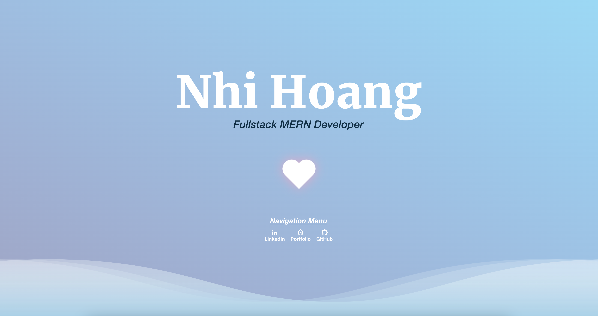

  
  

  <h3 align="center">React Portfolio</h3>

  

Constructing a portfolio page through the implementation of React to present a display of my professional work and competencies. By harnessing the capabilities of React, a JavaScript library tailored for crafting user interfaces, I introduce an element of dynamism and responsiveness into the portfolio. The creation of components for distinct sections—projects, skills, and a professional overview—combined with adept state management, ensures a interactive experience for visitors. The strategic integration of React Router further refines user navigation across various pages. The pages will also only render when all the components are ready to optimize display. Styling is approached by leveraging the Flowbite React documents and custom CSS to uphold a polished and professional aesthetic. Deployment of the portfolio is executed with uses GitHub Pages and Netlify for hosting. A landing page also keeps the portfolio looking clean.
  

### Built With

<!-- LICENSE -->
## License

Distributed under the MIT License. See `LICENSE.txt` for more information.

<!-- CONTACT -->
## Contact

Nhi Hoang - [linkedin](https://www.linkedin.com/in/ynhihoang/)
Project Repo: [https://github.com/eviehoang/tech-blog](https://github.com/eviehoang/react-portfolio)
Render: [Render](https://main--lovely-froyo-daf96b.netlify.app/)

<!-- ACKNOWLEDGMENTS -->
## Acknowledgments

* [GitHub Emoji Cheat Sheet](https://www.webpagefx.com/tools/emoji-cheat-sheet)
* [Ileriaya Markdown-badges](https://github.com/Ileriayo/markdown-badges)
* [GitHub Pages](https://pages.github.com)
* [W3School](https://w3schools.com/graphics/svg_rect.asp) for tutorial codes and educational references.
* [MDN](https://developer.mozilla.org/en-US/) for example codes and educational references.
* [Flowbite React](https://www.flowbite-react.com/) CSS Library
